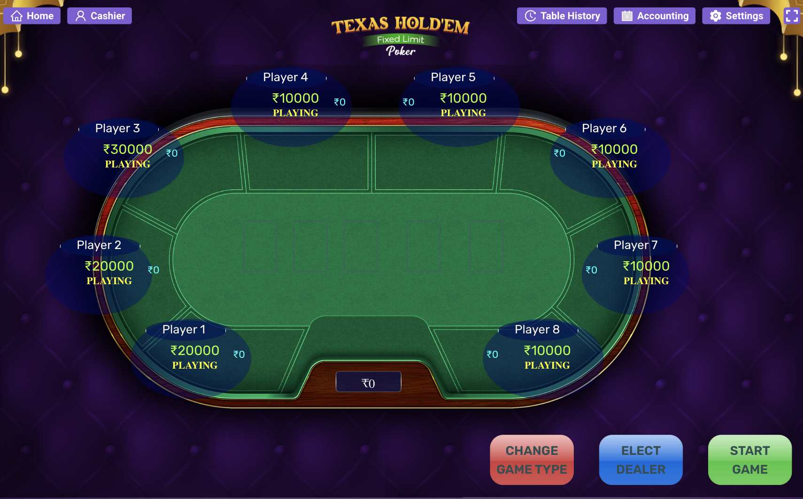
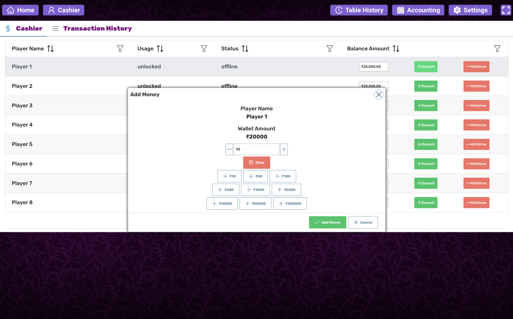
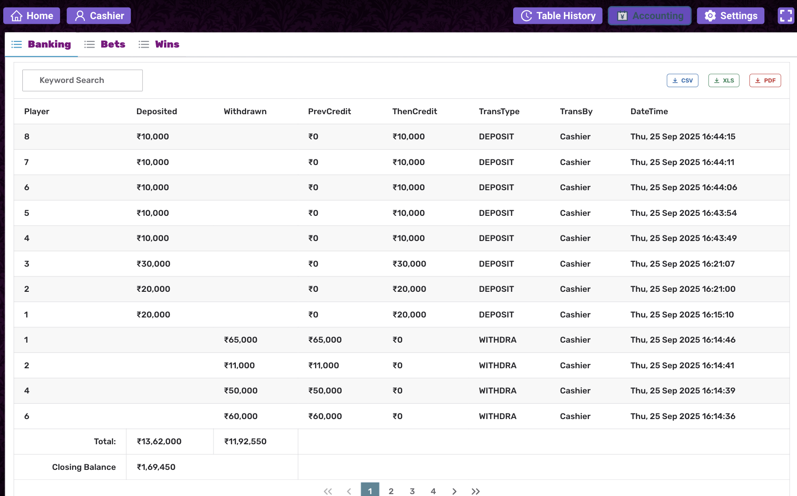
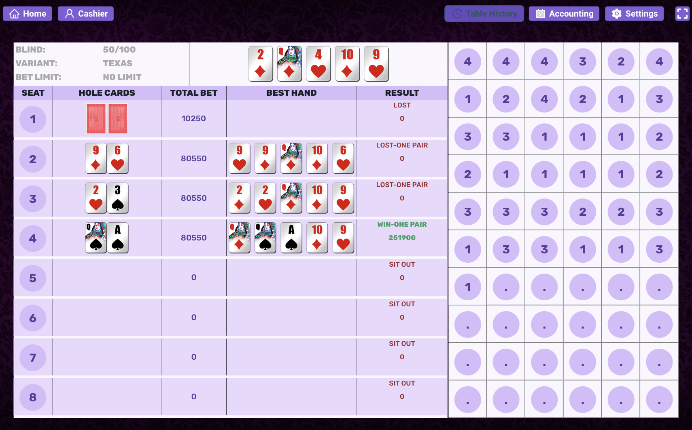
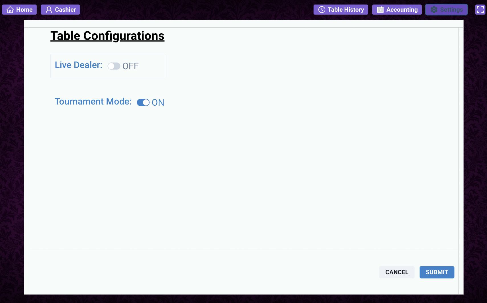

# Poker Admin React App

[]()
[]()
[]()

A lightweight admin panel built with React for administering a poker application — manage players, tournaments, leaderboards, chips, and view reports. This repository contains the front-end React application (mostly CSS and JavaScript) for the admin interface.

## Table of contents

- [Demo / Screenshots](#demo--screenshots)
- [Features](#features)
- [Tech stack](#tech-stack)
- [Prerequisites](#prerequisites)
- [Getting started](#getting-started)
- [Environment variables](#environment-variables)
- [Available scripts](#available-scripts)
- [Project structure (suggested)](#project-structure-suggested)
- [Building & Deployment](#building--deployment)

## Demo / Screenshots

<p align="center">
  
  <br/>
  <em>Poker Table - Dealer View</em>
</p>

<p align="center">
  
  <br/>
  <em>Banking</em>
</p>

<p align="center">
  
  <br/>
  <em>Accounting</em>
</p>

<p align="center">
  
  <br/>
  <em>Game Recall</em>
</p>

<p align="center">
  
  <br/>
  <em>Multi Game Configuration</em>
</p>

<p align="center">
  
  <br/>
  <em>Table Configuration</em>
</p>

## Features

- User & player management
- Poker game management (Texas Hold'em, Omaha variants)
- Chip and ledger management (transactions)
- Reports and exports (CSV / JSON)
- Redux Toolkit for state, rxjs + redux-observable for complex async flows
- Emotion for CSS-in-JS styling

## Tech stack

- React 18 - UI Library (Used functional components + hooks)
- Redux (Redux Toolkit) for State Management (store + slice)
- RxJS + redux-observable (epics) for side effects & complex async streams
- @emotion/react for styling

## Prerequisites

- Node.js (>= V20.12.2)
- npm
- Access to the backend API

## Getting started

1. Clone the repo

```bash
git clone https://github.com/1-Wildace/poker-admin-react-app.git
cd poker-admin-react-app
```

2. Install dependencies

```bash
# npm
npm install --force

```

3. Create environment file

Create a `.env` file in the project root (see [Environment variables](#environment-variables)).

4. Build the production bundle

```bash
npm run build

```

Open http://localhost:9000 (or the port configured) in your browser.

## Environment variables

Create a `.env`

```env
SERVER_NAME=localhost
SERVER_PORT=9000
```

Adjust variables to match your backend and authentication provider.

## Available scripts

(Adjust these to match scripts in your package.json.)

- `start` — Run the app in development mode.
- `build` — Create a production build in `build/` (or `dist/`).

Example:

```bash
npm run start
npm run build
```

## Project structure

A typical layout you can follow or adapt:

```
src/
  components/       # Reusable UI components
  pages/            # Route-level pages (Dashboard, Players, Tournaments)
  services/         # API calls and adapters
  hooks/            # Custom React hooks
  context/          # Context providers (auth, theme)
  styles/           # Global CSS and variables
  utils/            # Utilities and helpers
  assets/           # Images, icons
  App.js
  index.js
public/
  index.html
```

## Development guidelines

- Follow the project's lint and formatting rules (ESLint + Prettier recommended).
- Prefer small, focused PRs with a descriptive title.

## Building & Deployment

Create an optimized production bundle:

```bash
npm run build
```

Deploy the contents of the `build/` (or `dist/`) folder to your static host (Netlify, Vercel, GitHub Pages, S3 + CloudFront, etc.). Configure your CI/CD to set proper environment variables and run the build step.
