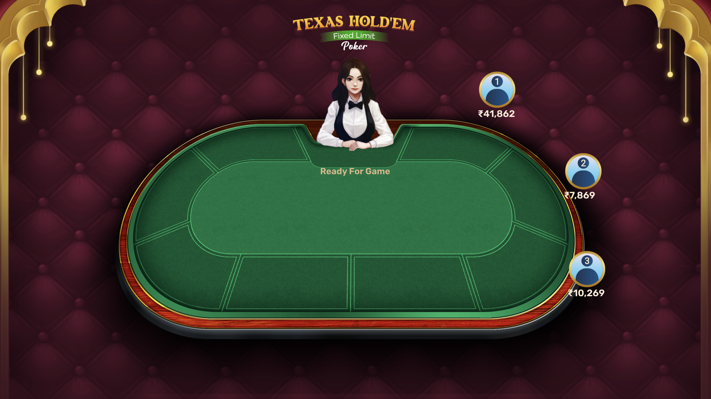
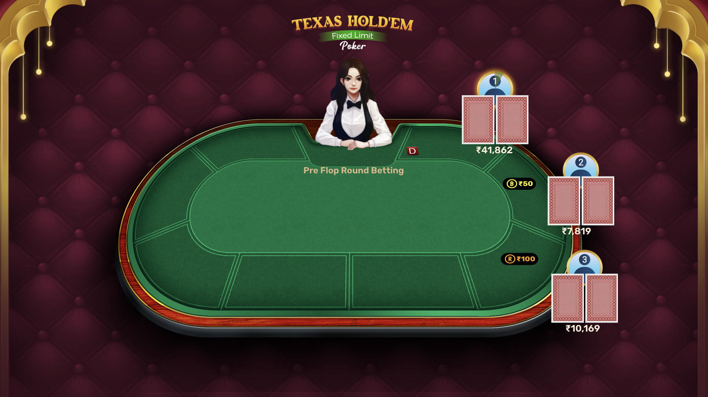
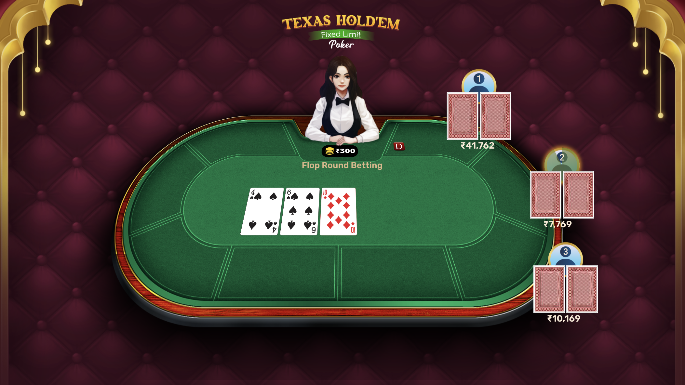
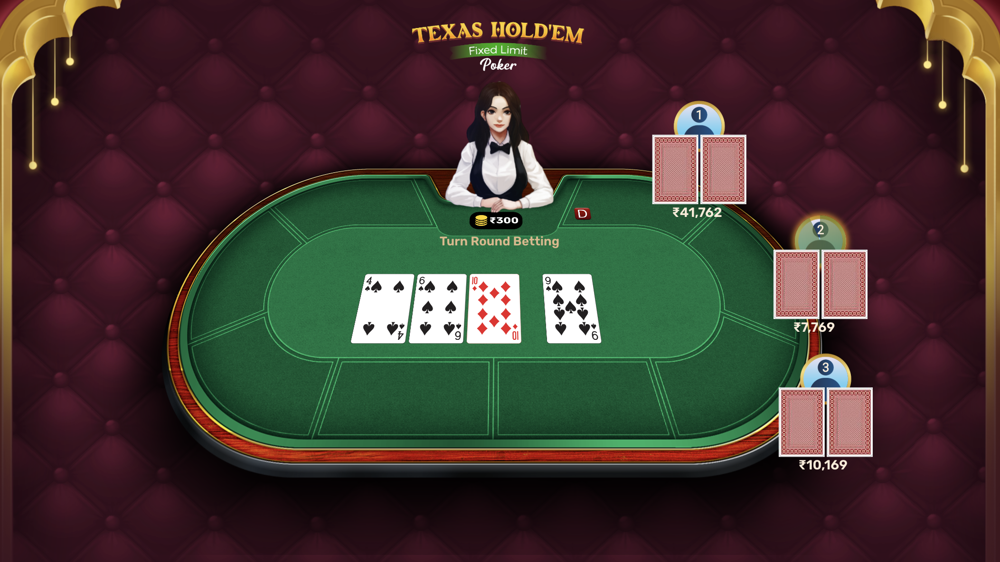
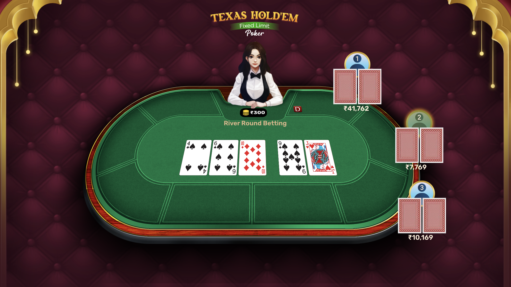
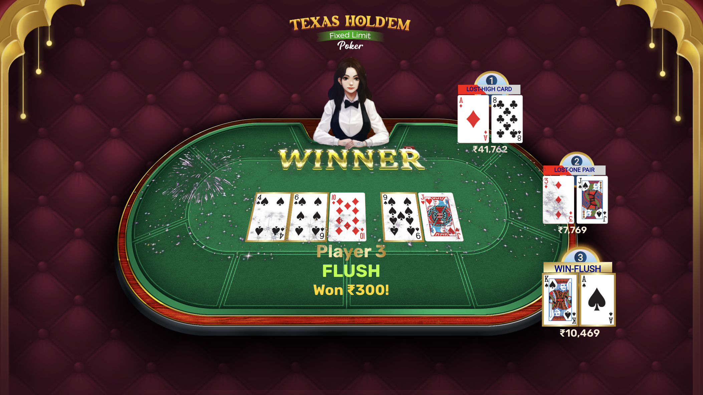

# Poker Topper (React)

[]()
[]()
[]()

A React frontend for Poker Topper — a small web app that evaluates poker hands, displays leaderboards, and helps players compare hands and results visually. This repository contains the client-side UI built with React to interact with an evaluator/leaderboard service.

## Table of contents

- [Demo / Screenshots](#demo--screenshots)
- [Features](#features)
- [Tech stack](#tech-stack)
- [Prerequisites](#prerequisites)
- [Getting started](#getting-started)
- [Environment variables](#environment-variables)
- [Available scripts](#available-scripts)
- [Building & Deployment](#building--deployment)

## Demo / Screenshots

<p align="center">
  
  <br/>
  <em>Ready View</em>
</p>
<p align="center">
  
  <br/>
  <em>Pre-Flop View</em>
</p>

<p align="center">
  
  <br/>
  <em>Flop Stage</em>
</p>

<p align="center">
  
  <br/>
  <em>Turn Stage</em>
</p>

<p align="center">
  
  <br/>
  <em>River Stage</em>
</p>

<p align="center">
  
  <br/>
  <em>Multi Game Configuration</em>
</p>

## Features

- Interactive poker hand evaluation and comparison
- Leaderboard for tracking top hands / players
- Clean, responsive UI built with React
- Redux Toolkit for state, rxjs + redux-observable for complex async flows
- Emotion for CSS-in-JS styling

## Tech stack

- React 18 - UI Library (Used functional components + hooks)
- Redux (Redux Toolkit) for State Management (store + slice)
- RxJS + redux-observable (epics) for side effects & complex async streams
- @emotion/react for styling

## Prerequisites

- Node.js (>= V20.12.2)
- npm
- Access to the backend API

## Getting started

1. Clone the repo

```bash
git clone https://github.com/1-Wildace/poker-topper-react-app.git
cd poker-topper-react-app
```

2. Install dependencies

```bash
# npm
npm install --force

```

3. Create environment file

Create a `.env` file in the project root (see [Environment variables](#environment-variables)).

4. Build the production bundle

```bash
npm run build

```

Open http://localhost:9000 (or the port configured) in your browser.

## Environment variables

Create a `.env`

```env
SERVER_NAME=localhost
SERVER_PORT=9000
```

Adjust variables to match your backend and authentication provider.

## Available scripts

(Adjust these to match scripts in your package.json.)

- `start` — Run the app in development mode.
- `build` — Create a production build in `build/` (or `dist/`).

Example:

```bash
npm run start
npm run build
```

## Building & Deployment

Create an optimized production bundle:

```bash
npm run build
```

Deploy the contents of the `build/` (or `dist/`) folder to your static host (Netlify, Vercel, GitHub Pages, S3 + CloudFront, etc.). Configure your CI/CD to set proper environment variables and run the build step.
